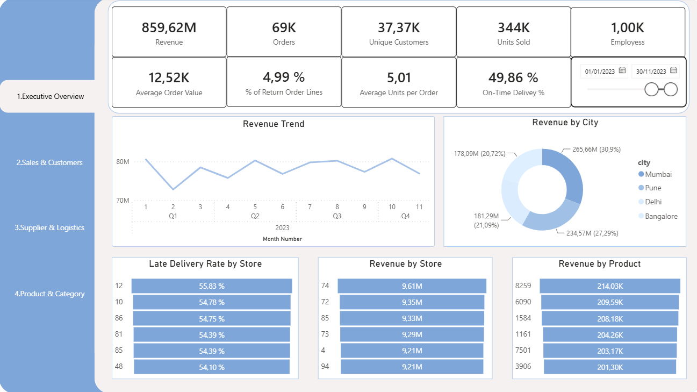
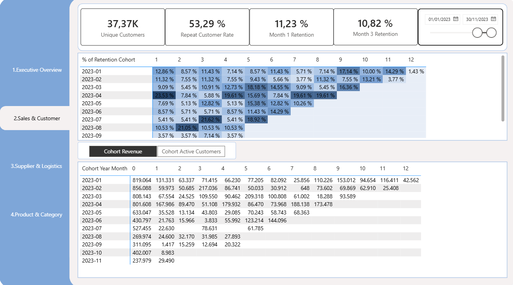
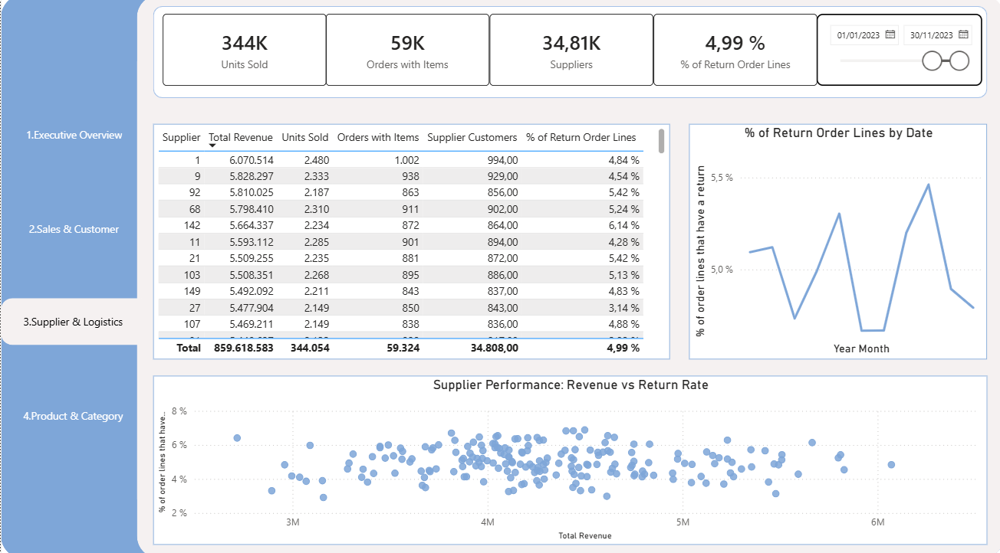
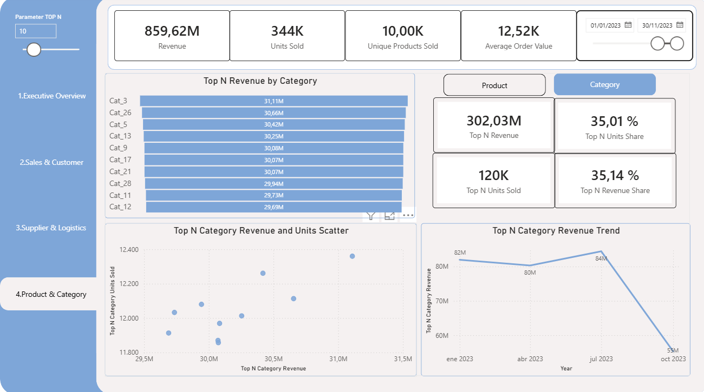

# Product Revenue Analysis

Power BI dashboard for analyzing sales, revenue and product performance
across orders, order lines, returns, stores and product categories.

---

## 📊 Dashboard

### 1.Executive Overview



The dashboard provides an interactive overview of product revenue
performance, allowing users to explore the data through filters,
rankings and different revenue metrics.

### 2.Sales & Customers



Analysis of revenue performance across products and over time.

### 3.Supplier & Logistics



Interactive Top N analysis showing product rankings and the
contribution of the selected products to total revenue.

### 4.Product & Category



---

## 🔎 About the Project

This project takes a raw CSV dataset and transforms it into an
interactive Power BI dashboard.

The goal is to explore the available data, identify relevant patterns
and provide useful insights through data visualization.

The project covers:

- Data preparation with Power Query
- Data modeling
- DAX measures
- Interactive visualizations
- Product ranking analysis
- Revenue concentration analysis

---

## 🗂️ Dataset

The analysis is based on a CSV dataset containing product and
revenue-related information.

- **Source:** CSV
- **Format:** `.csv`
- **Time period:** ...
- **Records:** ...
- **Products:** ...

---

## 🛠️ Tools & Technologies

- Power BI
- Power Query
- DAX
- CSV
- Git
- GitHub

---

## 🔍 Analysis

### Revenue Performance

...

### Product Ranking

...

### Revenue Concentration

...

---

## 💡 Key Insights

- ...
- ...
- ...

---

## 📁 Project Structure

```text
PowerBI-DashBoard-Product-Revenue-Analysis/
│
├── data/
├── powerbi/
│   └── Product-Revenue-Analysis.pbix
├── screenshots/
└── README.md
