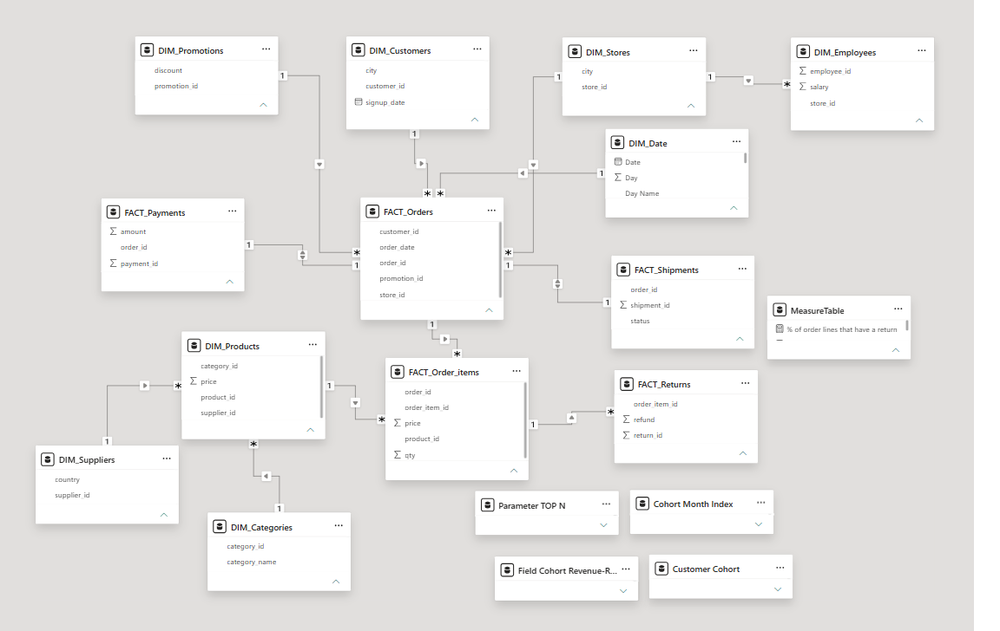

# Product Revenue Analysis

Power BI dashboard for analyzing sales, revenue and product performance
across orders, order lines, returns, stores and product categories.

---

## 📊 Dashboard

### 1. Executive Overview


The Executive Overview brings together the most relevant business metrics in a single view, providing a quick and easy way to understand overall sales, revenue and performance.

### 2. Sales & Customers


The Sales & Customers page provides a cohort-based view of customer retention, grouping customers by the month of their first purchase. Retention is measured by customer activity over time, allowing customers to be considered active in non-consecutive months.

Additional cohort analyses provide context through revenue and units sold, with the ability to switch between the two metrics dynamically.

### 3. Supplier & Logistics


The Supplier & Logistics page focuses on supplier performance, with particular attention to return rates. A scatter plot compares supplier revenue against return rates to explore whether higher-revenue suppliers tend to experience higher return rates. The analysis shows that return rates can vary considerably among suppliers with similar revenue levels, with observed rates ranging from approximately 2% to 8% within comparable revenue ranges, suggesting that revenue alone does not appear to explain differences in return rates

### 4. Product & Category


The Product & Category page provides a dynamic analysis of product and
category performance.

An interactive **Top N parameter** allows users to control the number of
products or categories included across the visualizations, while
**bookmarks** make it possible to switch between Product and Category
analysis.

The analysis explores:

- The relationship between revenue and units sold
- Revenue trends for the selected Top N
- Revenue generated by each selected product or category
- The share of total revenue represented by the selected Top N
- The share of total units sold represented by the selected Top N
---

## 🔎 About the Project

This project takes a raw CSV dataset and transforms it into an interactive
Power BI dashboard.

The goal is to explore the available data, identify relevant patterns and
provide useful insights through data visualization.

The project covers:

- Data preparation with Power Query
- Data modeling
- DAX measures
- Interactive visualizations
- Product and category ranking analysis
- Cohort analysis
- Bookmarks
- Field parameters
- Dashboard navigation

---

## 🗂️ Dataset

The analysis is based on a CSV dataset containing product and
revenue-related information.

- **Source:** CSV
- **Format:** `.csv`
- **Total Tables:** 13
- **FACT Tables:** 5
- **DIM Tables:** 8




## ⚠️ Data Quality Considerations

During the data exploration, an inconsistency was identified between
`FACT_Orders` and `FACT_Order_Items`.

Approximately 40K orders in `FACT_Orders` do not have corresponding
records in `FACT_Order_Items`. These records can be easily identified
by merging both tables using `order_id` and keeping the unmatched rows.

Since these orders have no associated order items, they may need to be
excluded from certain sales analyses depending on the intended business
logic. However, I chose not to remove them from the original dataset,
as there was not enough information to determine whether these records
were invalid or represented a different type of order.

On the other hand, every record in `FACT_Order_Items` has a corresponding
record in `FACT_Orders`, meaning there are no order items without a
matching order.


---

## 🛠️ Tools & Technologies

- Power BI
- Power Query
- DAX
- CSV
- Git
- GitHub

---

## 🔍 Analysis

### Revenue Performance

...

### Product Ranking

...

### Revenue Concentration

...

---

## 💡 Key Insights

- ...
- ...
- ...

---

## 📁 Project Structure

```text
PowerBI-DashBoard-Product-Revenue-Analysis/
│
├── data/
├── powerbi/
│   └── Product-Revenue-Analysis.pbix
├── screenshots/
└── README.md
